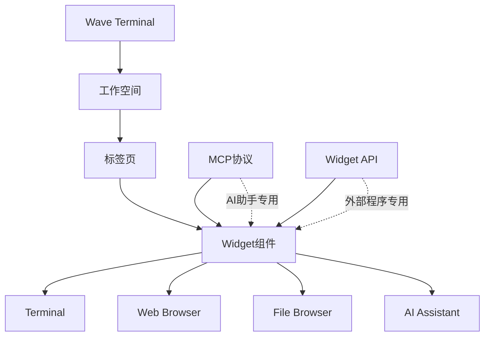

# Wave Terminal 系统架构概览

## 🏗️ 整体架构图

```
┌─────────────────────────────────────────────────────────────┐
│                    Wave Terminal 应用                        │
├─────────────────────────────────────────────────────────────┤
│  前端 (React/TypeScript)                                    │
│  ├── 工作空间管理 (Workspaces)                              │
│  ├── Widget 系统 (Terminal, Web, Files, AI, etc.)          │
│  ├── MCP 客户端界面 (mcpclient.tsx)                        │
│  └── MCP 服务器控制 (mcpservercontrol.tsx)                │
├─────────────────────────────────────────────────────────────┤
│  后端 (Go)                                                  │
│  ├── HTTP 服务器 (pkg/web/)                                │
│  ├── Widget API 服务 (pkg/service/widgetapiservice/)      │
│  ├── 核心逻辑 (pkg/wcore/)                                 │
│  └── WebSocket 通信                                        │
├─────────────────────────────────────────────────────────────┤
│  MCP 集成层                                                │
│  ├── MCP Bridge Server (mcp-bridge.cjs)                   │
│  ├── MCP 协议实现                                         │
│  └── AI 工具调用接口                                       │
└─────────────────────────────────────────────────────────────┘
```

## 🔄 API 系统对比

### MCP (Model Context Protocol)
```
AI助手 (Claude Code)
       ↓ MCP协议
MCP Bridge Server (mcp-bridge.cjs)
       ↓ HTTP调用
Wave Terminal Widget API
       ↓ 内部调用
Widget 创建和管理
```

### Widget API (HTTP REST)
```
外部应用程序
       ↓ HTTP REST
Wave Terminal HTTP Server
       ↓ 内部调用  
Widget API Service
       ↓ 核心逻辑
Widget 创建和管理
```

## 📊 核心概念关系图



## 🎯 使用场景映射

### MCP 使用场景
- ✅ **Claude Code** 创建终端和工作空间
- ✅ **AI 自动化工具** 批量管理 widgets
- ✅ **智能开发助手** 根据上下文创建合适的工具
- ✅ **AI 代理系统** 执行复杂的工作流

### Widget API 使用场景  
- ✅ **IDE 插件** 集成 Wave Terminal 功能
- ✅ **自动化脚本** 批量创建开发环境
- ✅ **第三方应用** 嵌入终端功能
- ✅ **管理工具** 监控和控制 Wave Terminal

## 🔧 技术栈概览

### 前端技术栈
- **框架**: React 18 + TypeScript
- **状态管理**: Jotai
- **样式**: SCSS + CSS Modules  
- **构建**: Vite + Electron

### 后端技术栈
- **语言**: Go
- **数据库**: SQLite
- **通信**: HTTP REST + WebSocket
- **构建**: Task (Taskfile.yml)

### MCP 技术栈
- **协议**: Anthropic MCP
- **实现**: Node.js + @modelcontextprotocol/sdk
- **通信**: JSON-RPC over stdio/HTTP

## 📁 文件组织结构

```
Wave Terminal 项目结构
├── frontend/                    # React 前端
│   ├── app/element/            # UI 组件
│   │   ├── mcpclient.tsx      # MCP 客户端
│   │   └── mcpservercontrol.tsx # MCP 控制
│   └── app/store/             # 状态管理
│       └── mcpapi.ts          # MCP API 接口
├── pkg/                       # Go 后端
│   ├── web/                   # HTTP 服务器
│   │   └── widgetapi.go       # Widget API 处理器
│   └── service/               # 业务服务
│       └── widgetapiservice/  # Widget API 服务
├── mcp-bridge.cjs            # MCP 桥接服务器
├── ai_docs/                  # AI 文档
│   ├── mcp-vs-widget-api.md  # 概念区分
│   ├── mcp-development.md    # MCP 开发指南
│   └── widget-api.md         # Widget API 文档
└── Taskfile.yml             # 构建配置
```

## 🚀 开发工作流

### 1. 开发环境启动
```bash
task dev          # 启动开发服务器
node mcp-bridge.cjs  # 启动 MCP 服务器 (可选)
```

### 2. API 调用流程

#### MCP 调用流程
```
1. AI助手发起MCP工具调用
2. MCP Bridge接收并解析请求
3. 转换为Widget API HTTP调用
4. Wave Terminal处理并返回结果
5. MCP Bridge格式化响应返回AI助手
```

#### Widget API 调用流程
```
1. 外部程序发起HTTP请求
2. Wave Terminal HTTP服务器接收
3. Widget API服务处理业务逻辑
4. 创建/管理Widget组件
5. 返回JSON响应给外部程序
```

## 📚 相关文档索引

- [MCP vs Widget API 概念区分](./mcp-vs-widget-api.md)
- [MCP 开发指南](./mcp-development.md)  
- [Widget API 参考](./widget-api.md)
- [项目构建指南](../BUILD.md)
- [开发入门指南](../README.md)

---

> 💡 **理解要点**: Wave Terminal 通过两套API系统服务不同的用户群体 - MCP面向AI助手，Widget API面向传统应用程序。两者在底层共享相同的widget创建和管理机制。